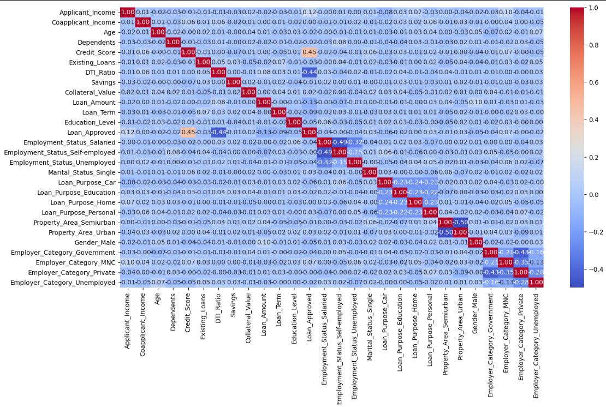

# Loan Approval Prediction using Machine Learning

## Overview
This project implements an end-to-end machine learning pipeline to predict loan approval outcomes based on applicant financial and demographic data. The objective is to demonstrate practical skills in data preprocessing, exploratory data analysis (EDA), feature engineering, model building, and evaluation using structured real-world data.

The project addresses a financial risk assessment use case, where accurate predictions help reduce incorrect loan approvals and support data-driven decision-making.

---

## Dataset Description
The dataset contains historical loan application records. Each row represents a loan applicant, and each column represents a factor influencing loan approval.

### Features

Numerical Features
- Applicant Income  
- Co-Applicant Income  
- Loan Amount  
- Loan Amount Term  
- Credit History  

Categorical Features
- Gender  
- Marital Status  
- Education  
- Self-Employed  
- Property Area  

Target Variable
- Loan_Status  
  - 1 → Loan Approved  
  - 0 → Loan Not Approved  

The dataset includes missing values, categorical variables, and features on different scales, making it suitable for real-world data preprocessing and modeling.

---

## Exploratory Data Analysis (EDA)
Exploratory data analysis was performed to understand data distributions, identify missing values, and analyze relationships between features. Correlation analysis and visualizations were used to extract meaningful insights from the data.

---
### Correlation Heatmap

The correlation heatmap below visualizes the linear relationships between numerical features and encoded categorical variables.

- Most features show low to moderate correlation, indicating minimal multicollinearity.
- Credit score and loan approval status exhibit a positive correlation, highlighting credit history as an important factor.
- Engineered and encoded categorical variables do not introduce strong unintended correlations.

This analysis helped validate feature independence assumptions and informed model selection decisions.

## Data Preprocessing and Feature Engineering
The following steps were applied:
- Handling missing values using appropriate imputation techniques  
- Encoding categorical variables using Label Encoding and One-Hot Encoding  
- Feature scaling using StandardScaler  
- Feature engineering to improve model performance  

---

## Model Building
Multiple supervised classification algorithms were trained and evaluated:
- Logistic Regression  
- K-Nearest Neighbors (KNN)  
- Naive Bayes  

The dataset was split into training and testing sets using an 80–20 ratio.

---

## Model Evaluation
Models were evaluated using standard classification metrics:
- Accuracy  
- Precision  
- Recall  
- F1-Score  
- Confusion Matrix  

### Performance Summary
- Before feature engineering, Naive Bayes achieved the highest precision.  
- After feature engineering, Logistic Regression showed the best overall performance with improved accuracy, recall, and F1-score.  

Model selection was driven by business-relevant metrics rather than accuracy alone.

---

## Key Insights
- Feature engineering significantly impacts model performance.  
- Logistic Regression benefits the most from engineered features.  
- Precision is a critical metric in financial risk assessment to reduce false approvals.  
- Simpler models can perform competitively on well-structured datasets.  

---

## Future Improvements
- Hyperparameter tuning for model optimization  
- Cross-validation for robust evaluation  
- Implementation of ensemble models such as Random Forest or XGBoost  
- Deployment using Streamlit or Flask  

---

## Tech Stack
- Python  
- Pandas, NumPy  
- Matplotlib, Seaborn  
- Scikit-learn  

---

## Author
Kabir Patil  
Aspiring Data Analyst / Data Scientist  

---

## License
This project is intended for educational and portfolio purposes.
